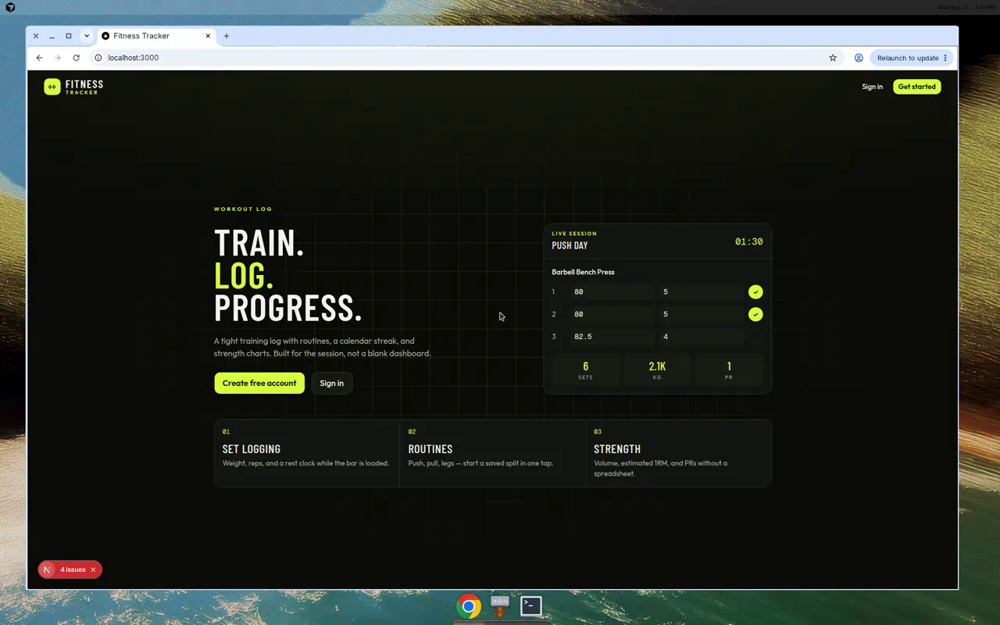
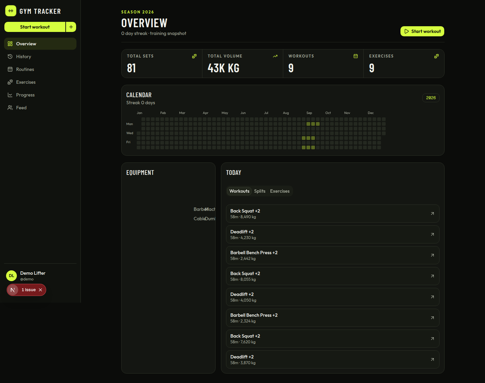
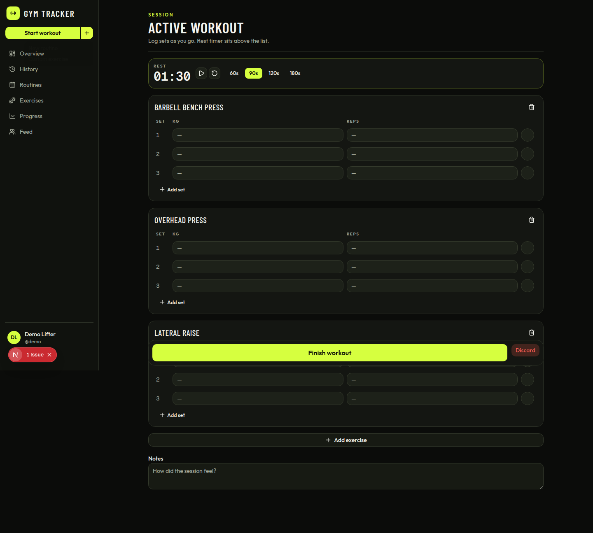
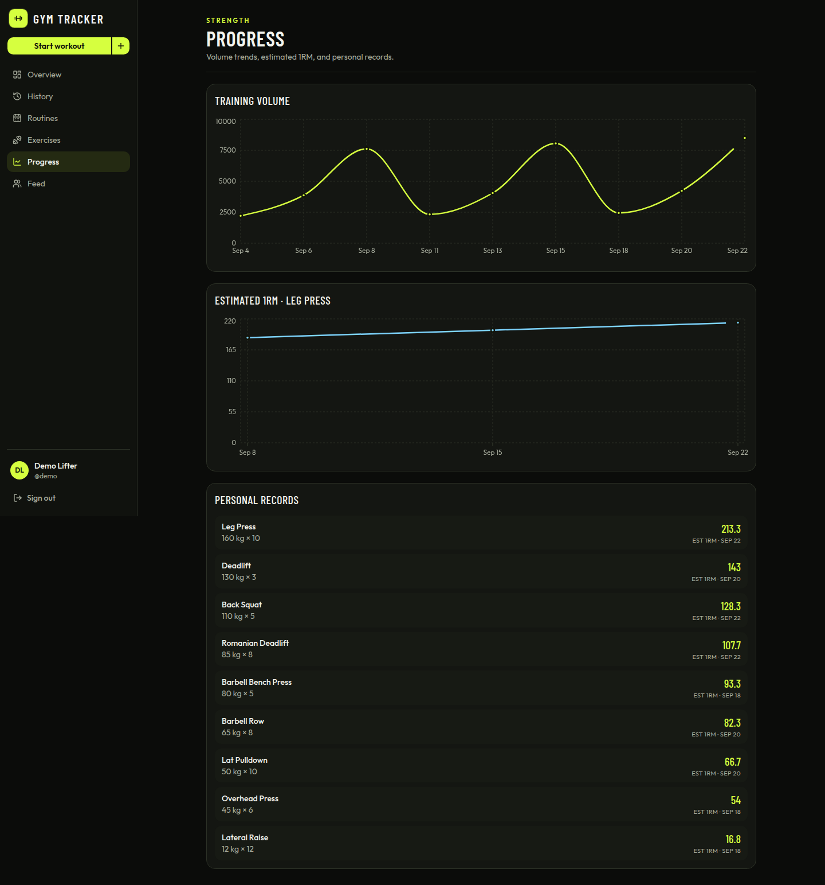

# Gym Tracker

A Strong/Hevy-style workout logger for lifters who want fast set logging, routine templates, and progress charts. A junior SE portfolio project.

Log sets during a session, reuse routines, review history, and follow other lifters. The app runs on your machine with Docker Compose or a local Node and Postgres setup.

## Demo

**Availability: local/Docker only.** There is no Vercel live demo.

**Screenshots** of the local UI are in [`docs/screenshots/`](docs/screenshots/).









`npm run db:seed` also creates a local demo lifter (`demo@gymtracker.local` / `gymtracker`) with about three weeks of sessions so the progress charts are not a single dot.

### Status

- **Demo:** local Docker Compose or a native `npm run dev` server.
- **Railway:** on free and trial tiers, Postgres can sleep after inactivity. The first query after sleep may stall until the database wakes. From a laptop or from Vercel, use Railway’s public URL (`DATABASE_PUBLIC_URL`), not the private network hostname.
- **Auth.js:** email and password work with `AUTH_SECRET` and the database alone. Google sign-in is optional and appears only when both `AUTH_GOOGLE_ID` and `AUTH_GOOGLE_SECRET` are set.

## Features

- Sign up and sign in with email and password (Google when those env vars are set)
- Exercise library (53 seeded movements) plus custom exercises
- Routine builder to save and reuse templates
- Active workout logging with a rest timer
- Workout history and detail views
- Progress: training-volume chart, estimated 1RM, and personal records
- Dashboard training heatmap
- Social: profiles, follow and unfollow, a feed, and likes

## Stack

Versions match `package.json`.

| Layer | Tech | Intended host |
| --- | --- | --- |
| App (UI + API) | Next.js 16 (App Router), React 19, TypeScript | [Vercel](https://vercel.com) Hobby |
| Database | PostgreSQL, Prisma 6 | Neon, Prisma Postgres, or any pooled Postgres |
| Auth | Auth.js (NextAuth v5) — email/password, optional Google | — |
| UI | Tailwind CSS 4, shadcn/ui | — |
| Charts | Recharts 3 | — |

## Setup

Node.js 20+ matches the Docker image. Postgres 16 matches `docker-compose.yml`.

### Option A — Docker Compose

Docker Compose starts the app and Postgres. You do not need a local `.env` for this path; the compose file injects one local database URL as both `DATABASE_URL` and `DIRECT_URL`, plus a dev `AUTH_SECRET`.

1. Install [Docker Desktop](https://www.docker.com/products/docker-desktop/) (or Docker Engine with Compose v2).
2. From the repo root, build and start both services:

   ```bash
   docker compose up --build
   ```

   Detached equivalent: `npm run docker:up`.

3. Open [http://localhost:3000](http://localhost:3000).
4. Postgres is on `localhost:5432` (`postgres` / `postgres` / `gymtracker`).
5. On boot the web container waits for Postgres, runs `prisma migrate deploy`, and seeds the exercise library plus a demo lifter with sample history.

```bash
docker compose down          # stop
docker compose down -v       # stop and wipe the database volume
docker compose logs -f web   # follow app logs (or npm run docker:logs)
npm run docker:down          # stop via the npm script
```

### Option B — Native

1. Install Node.js 20+ and PostgreSQL 16 (or point `DATABASE_URL` and `DIRECT_URL` at a hosted Postgres).
2. Install dependencies:

   ```bash
   npm install
   ```

3. Configure environment:

   ```bash
   cp .env.example .env
   ```

   Fill in the variables in the table below. Generate a secret with `openssl rand -base64 32`.

4. Apply the baseline migration and seed the exercise library plus the demo lifter:

   ```bash
   npx prisma migrate deploy
   npm run db:seed
   ```

   `npm run db:push` is only for local experiments. Deploys use `prisma migrate deploy`.

5. Start the dev server:

   ```bash
   npm run dev
   ```

6. Open [http://localhost:3000](http://localhost:3000).

### Environment variables

Copied from `.env.example`.

| Variable | Required | Purpose |
| --- | --- | --- |
| `DATABASE_URL` | Yes | Pooled runtime Postgres URL. Locally and in Docker, the single database URL. On Neon, the pooler host. For PgBouncer, add `pgbouncer=true` and `connection_limit=1` if they are not already in the string. |
| `DIRECT_URL` | Yes | Direct, unpooled URL for `prisma migrate deploy`. Neon often names this `DATABASE_URL_UNPOOLED`; copy that value here. Locally and in Docker, set it to the same URL as `DATABASE_URL`. |
| `AUTH_SECRET` | Yes | Auth.js signing secret (`openssl rand -base64 32`). |
| `AUTH_URL` | Yes | Public origin, no trailing slash. Local: `http://localhost:3000`. Production: `https://<your-domain>`. |
| `NEXTAUTH_URL` | Recommended | Same origin as `AUTH_URL`. Auth.js still reads this alias. |
| `AUTH_TRUST_HOST` | Recommended | `true` when the host is forwarded (Docker, Vercel). The Auth.js config also sets `trustHost`. |
| `AUTH_GOOGLE_ID` | No | Google OAuth client id. The Google button stays hidden when this or the secret is unset. |
| `AUTH_GOOGLE_SECRET` | No | Google OAuth client secret. |
| `CRON_SECRET` | Yes in production | Bearer token for `GET /api/cron/reset-demo`. |

Docker Compose overrides `DATABASE_URL`, `DIRECT_URL`, `AUTH_SECRET`, `NEXTAUTH_URL`, `AUTH_URL`, and `AUTH_TRUST_HOST` inside the web container (see `docker-compose.yml`). `DIRECT_URL` matches `DATABASE_URL` there because Compose uses one Postgres, not a pooler.

## Deploying to Vercel

Host the Next.js app on Vercel and the database on any standard pooled Postgres. Neon through the Vercel Marketplace and Prisma Postgres both work. This repository does not include a live URL. Use the origin Vercel assigns after the first deploy.

### Environment variables

Set these on the Vercel project before the first build. `prisma migrate deploy` runs during the build, so `DATABASE_URL` and `DIRECT_URL` must exist then.

| Variable | Value |
| --- | --- |
| `DATABASE_URL` | Pooled runtime URL. Neon: the host with `-pooler`. Add `pgbouncer=true` and `connection_limit=1` when the URL does not already include them. |
| `DIRECT_URL` | Direct URL (Neon: `DATABASE_URL_UNPOOLED`, or the host without `-pooler`). |
| `AUTH_SECRET` | `openssl rand -base64 32` |
| `AUTH_URL` | `https://<your-domain>` (no trailing slash). Same value for `NEXTAUTH_URL`. |
| `AUTH_TRUST_HOST` | `true` |
| `CRON_SECRET` | Long random string. Vercel Cron sends it as `Authorization: Bearer <CRON_SECRET>`. |
| `AUTH_GOOGLE_ID` | Optional. Omit both Google variables to hide the button. |
| `AUTH_GOOGLE_SECRET` | Optional Google client secret. |

Google callback URL for a new domain: `https://<your-domain>/api/auth/callback/google`

Local development uses one database. Set `DATABASE_URL` and `DIRECT_URL` to that same URL (see `.env.example`). Docker Compose does this for you.

### Build

The Vercel build command is `npm run vercel-build`:

```bash
prisma generate && prisma migrate deploy && next build
```

`postinstall` also runs `prisma generate`. Do not use `prisma db push` for this deploy. `npm run build` stays `prisma generate && next build` so the Docker image can compile without a database.

### Demo account and nightly reset

The public demo lifter is `demo@gymtracker.local` / `gymtracker`. Visitors can log sets. `vercel.json` schedules `GET /api/cron/reset-demo` daily at `0 19 * * *` (19:00 UTC, which is 03:00 in Manila).

That route deletes only the demo user's workouts, sets, routines, custom exercises, and follows or likes that involve the demo user, then recreates about three weeks of sessions dated from the current day. Other accounts are left alone. If the exercise library or demo user is missing, the same request creates them, so the first cron call or a manual request bootstraps a fresh database:

```bash
curl -H "Authorization: Bearer $CRON_SECRET" https://<your-domain>/api/cron/reset-demo
```

`npm run db:seed` calls the same module. You can run it with production `DATABASE_URL` and `DIRECT_URL` if you prefer a one-off seed from your machine. The reset route is the path that also wipes and rebuilds demo history.

### Railway

Railway Postgres still works if you set both `DATABASE_URL` and `DIRECT_URL` to the public URL (`DATABASE_PUBLIC_URL`). Free and trial instances can sleep when idle. After a cold start, retry once the database is awake.

## Scripts

| Command | Description |
| --- | --- |
| `npm run dev` | Local Next.js server |
| `npm run build` | Generate the Prisma client and build for production |
| `npm run vercel-build` | Generate the client, run `prisma migrate deploy`, and build (Vercel) |
| `npm run start` | Start the production server |
| `npm run lint` | ESLint |
| `npm run db:migrate` | Create and apply a Prisma migration (`prisma migrate dev`) |
| `npm run db:push` | Push the schema without a migration file |
| `npm run db:seed` | Seed the exercise library and demo lifter history |
| `npm run db:studio` | Open Prisma Studio |
| `npm run docker:up` | `docker compose up --build -d` |
| `npm run docker:down` | Stop the Compose stack |
| `npm run docker:logs` | Follow web container logs |

## Project structure

```
prisma/           # schema, migrations, seed
src/app/(auth)/   # sign-in / sign-up
src/app/(app)/    # dashboard, workout, routines, history, progress, exercises, feed, profile
src/components/   # UI, workout, charts, social
src/lib/          # auth, db, validations, server actions
```

## Notes

- Estimated 1RM uses the Epley formula: `weight × (1 + reps / 30)`, rounded to one decimal. A one-rep set returns the weight itself (`src/lib/workout-utils.ts`).
- Warmup sets are excluded from volume when `isWarmup` is set. Sets that are not completed are excluded as well.
- Completed workouts from people you follow, plus your own completed workouts, appear on `/feed`.
- Email/password is the default Auth.js provider. Google is registered only when both `AUTH_GOOGLE_ID` and `AUTH_GOOGLE_SECRET` are present. `GOOGLE_CLIENT_ID` and `GOOGLE_CLIENT_SECRET` still work when the `AUTH_GOOGLE_*` pair is unset.
- Railway free-tier sleep is called out under [Status](#status). Budget for a cold start after idle time.

## License

[MIT](LICENSE).
